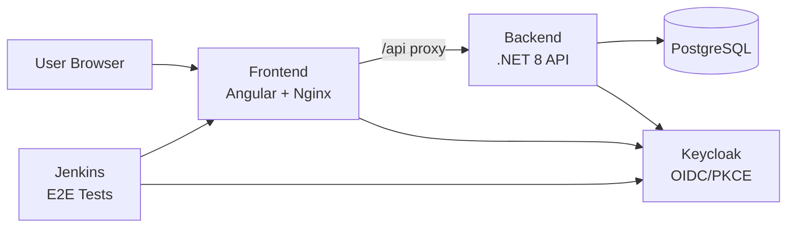

# HelpDesk Pro

A full-stack support ticket system built to demonstrate CI/CD with OpenShift.

## Architecture



| Component | Tech | Port |
|-----------|------|------|
| Frontend | Angular 17 + Material | 4200 (dev) / 8080 (container) |
| Backend | .NET 8 Web API | 8080 |
| Database | PostgreSQL 16 | 5432 |
| Auth | Keycloak 25 | 8180 (dev) / 8080 (container) |
| Jenkins | Jenkins LTS + Playwright | 9090 (dev) / 8080 (container) |

## Prerequisites

- Docker & Docker Compose
- .NET SDK 8.0 (for local backend dev)
- Node.js 20+ (for local frontend dev)
- Helm 3.14+ (for OpenShift deploy)
- `oc` CLI (for OpenShift deploy)
- Playwright (installed automatically via `e2e/scripts/install-deps.sh`)

## Local Development

```bash
# Start all services
make up

# View logs
make logs

# Stop and clean up
make down
```

### Running E2E Tests

```bash
# Run Playwright E2E tests against local docker-compose stack
make test-e2e

# Run tests in headed mode for debugging
make test-e2e-headed

# Open the last HTML report
make test-e2e-report
```

Services will be available at:
- **Frontend**: http://localhost:4200
- **Backend API**: http://localhost:8080/swagger
- **Keycloak Admin**: http://localhost:8180 (admin/admin)

## Demo Users

| Username | Password | Roles |
|----------|----------|-------|
| employee1 | password123 | employee |
| admin1 | password123 | employee, helpdesk-admin |
| tester1 | password123 | helpdesk-tester |

## OpenShift Deployment

### 1. Configure GitHub Secrets

| Secret | Description |
|--------|-------------|
| `OPENSHIFT_TOKEN` | `oc whoami -t` |
| `OPENSHIFT_SERVER` | `oc whoami --show-server` |
| `KEYCLOAK_HOST` | Route hostname for Keycloak |
| `OPENSHIFT_NAMESPACE` | Your OpenShift namespace (e.g. `myuser-dev`) |
| `GHCR_DOCKERCONFIGJSON` | Base64-encoded Docker config for GHCR pull secret |

To generate `GHCR_DOCKERCONFIGJSON`, create a GitHub Personal Access Token with `read:packages` scope
(**Settings → Developer settings → Personal access tokens → Tokens (classic)**), then run:

```bash
echo '{"auths":{"ghcr.io":{"auth":"'$(echo -n "<github-username>:<YOUR_PAT>" | base64)'"}}}'
```

Copy the full JSON output as the secret value.

### 2. Deploy

Push to `main` to trigger the GitHub Actions workflow, or deploy manually:

```bash
make deploy NAMESPACE=your-namespace
```

### 3. Check Status

```bash
make status NAMESPACE=your-namespace
make routes NAMESPACE=your-namespace
```

## Redeployment

After code changes, simply push to `main`. The CI/CD pipeline will:

1. Build new container images (tagged with commit SHA + `latest`)
2. Push to GitHub Container Registry (GHCR)
3. Deploy to OpenShift via Helm upgrade

## Redeployment After Sandbox Reset

The Red Hat Developer Sandbox resets every 30 days. Follow these steps to restore the environment from scratch in under 10 minutes.

### Step 1 — Log in to the new sandbox

Go to https://developers.redhat.com/developer-sandbox, start your new sandbox, then click **DevSandbox** to open the web console. Click your username (top-right) → **Copy login command** → **Display Token**.

```bash
oc login --token=<your-new-token> --server=<your-new-server>
```

### Step 2 — Update GitHub Secrets

```bash
# Get the values from your new session
oc whoami -t            # → OPENSHIFT_TOKEN
oc whoami --show-server # → OPENSHIFT_SERVER
```

Update both secrets in your GitHub repo: **Settings → Secrets and variables → Actions**.

### Step 3 — Do an initial deploy to create the routes

Trigger the pipeline (push an empty commit, or use workflow_dispatch):

```bash
git commit --allow-empty -m "chore: trigger redeploy after sandbox reset"
git push
```

Or deploy manually:

```bash
NAMESPACE=$(oc project -q)
make deploy NAMESPACE=$NAMESPACE
```

### Step 4 — Get the Keycloak route hostname

```bash
oc get route -n $(oc project -q) | grep keycloak
# Example output: helpdesk-pro-keycloak   keycloak-<namespace>.apps.<cluster>.openshiftapps.com
```

### Step 5 — Update the KEYCLOAK_HOST secret

Copy the hostname (without `https://`) and update it in GitHub: **Settings → Secrets → KEYCLOAK_HOST**.

### Step 6 — Redeploy with the correct Keycloak URL

Trigger the pipeline again (or re-run the last workflow from the Actions tab). This second deploy passes the correct Keycloak hostname so the backend and frontend config are wired up properly.

```bash
# Verify everything is running
make status NAMESPACE=$(oc project -q)
make routes NAMESPACE=$(oc project -q)
```

The app should be fully operational within a few minutes of the second deploy completing.


## Project Structure

```
.
├── backend/                  # .NET 8 Web API
│   ├── src/HelpDeskApi/      # Application source
│   └── Dockerfile
├── frontend/                 # Angular 17 SPA
│   ├── src/
│   ├── nginx.conf
│   └── Dockerfile
├── e2e/                      # Playwright E2E tests
│   ├── pages/                # Page Object Models
│   ├── tests/                # Test specs (auth, employee, admin, navigation)
│   ├── fixtures/             # Test data constants
│   ├── scripts/              # CI helper scripts
│   └── playwright.config.ts
├── jenkins/                  # Jenkins CI configuration
│   ├── Dockerfile            # Custom Jenkins image with Node.js + Playwright
│   ├── plugins.txt           # Jenkins plugins
│   ├── casc/                 # Jenkins Configuration as Code
│   └── jobs/                 # Job DSL definitions
├── helm/                     # Helm chart for OpenShift
│   ├── templates/
│   ├── values.yaml
│   └── values.openshift.yaml
├── keycloak/                 # Keycloak realm config
│   └── realm-export.json
├── docker-compose.yml        # Local development
├── Makefile                  # Convenience targets
└── .github/workflows/        # CI/CD pipeline
```
