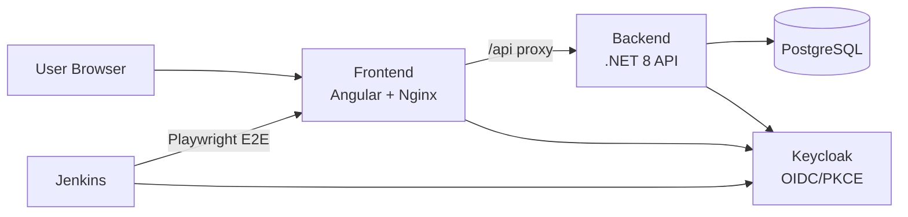

# HelpDesk Pro

A full-stack support ticket system built to demonstrate CI/CD with OpenShift.

## Architecture



| Component | Tech | Port |
|-----------|------|------|
| Frontend | Angular 17 + Material | 4200 (dev) / 8080 (container) |
| Backend | .NET 8 Web API | 8080 |
| Database | PostgreSQL 16 | 5432 |
| Auth | Keycloak 25 | 8180 (dev) / 8080 (container) |
| CI / E2E | Jenkins LTS + Playwright | 9090 (dev) / 8080 (container) |

## Prerequisites

- **Docker & Docker Compose** — required (all services run in containers)
- Node.js 20+ and npm (only for running E2E tests outside Docker)
- Helm 3.14+ (for OpenShift deploy)
- `oc` CLI (for OpenShift deploy)

> **Note:** .NET SDK and Angular CLI are **not** needed locally — the backend and frontend build inside Docker. You only need Node.js if you want to run Playwright E2E tests directly on your machine.

## Local Development

```bash
# Start all services
make up

# View logs
make logs

# Stop and clean up
make down
```

Services will be available at:
- **Frontend**: http://localhost:4200
- **Backend API**: http://localhost:8080/swagger
- **Keycloak Admin**: http://localhost:8180 (admin/admin)
- **Jenkins**: http://localhost:9090 (login via Keycloak SSO)

> **First boot:** Jenkins takes ~2 minutes to start while it loads plugins and applies configuration. Wait for the health check to pass (`docker compose logs -f jenkins`) before accessing the UI.

## Demo Users

All accounts use password `password123`. Each person should use a different employee account to see ticket isolation in action.

| Username | Password | Roles | Access |
|----------|----------|-------|--------|
| employee1 | password123 | employee | Submit and view own tickets |
| employee2 | password123 | employee | Submit and view own tickets |
| employee3 | password123 | employee | Submit and view own tickets |
| employee4 | password123 | employee | Submit and view own tickets |
| employee5 | password123 | employee | Submit and view own tickets |
| admin1 | password123 | employee, helpdesk-admin | Manage all tickets + Jenkins admin |
| admin2 | password123 | employee, helpdesk-admin | Manage all tickets + Jenkins admin |
| tester1 | password123 | helpdesk-tester | Trigger Jenkins test jobs |

> **Ticket limit:** Each user can create up to 50 tickets (configurable in `appsettings.json`). The database comes pre-seeded with 12 demo tickets across different users, priorities, and statuses.

## E2E Testing (Playwright)

The `e2e/` directory contains a Playwright test suite covering authentication, ticket submission, admin dashboard, and navigation — across two browsers (Chromium, Firefox) and two roles (employee, admin).

### Prerequisites

All services must be running first:

```bash
make up
```

### Run Tests

```bash
# Headless (CI-style)
make test-e2e

# Headed (see the browser)
make test-e2e-headed

# View the HTML report from the last run
make test-e2e-report
```

Or run manually without Make:

```bash
cd e2e
npm ci
npx playwright install --with-deps chromium firefox
BASE_URL=http://localhost:4200 npx playwright test
```

### Test Projects

Playwright is configured with six projects — two setup projects (one per browser) and four test projects:

| Project | Role | Browser | Type |
|---------|------|---------|------|
| setup-chromium | both | Chromium | Auth setup |
| setup-firefox | both | Firefox | Auth setup |
| employee-chromium | employee1 | Chromium | Tests |
| employee-firefox | employee1 | Firefox | Tests |
| admin-chromium | admin1 | Chromium | Tests |
| admin-firefox | admin1 | Firefox | Tests |

Run a specific project:

```bash
cd e2e && npx playwright test --project=admin-chromium
```

### Test Data Cleanup

The test suite automatically cleans up after itself. `globalSetup` runs before all tests and `globalTeardown` runs after — both delete any tickets whose title starts with `E2E ` (the prefix used by all test-created tickets).

This keeps the admin dashboard clean across repeated runs. Cleanup uses a direct Keycloak token grant (Resource Owner Password Credentials) with the `admin1` user to authenticate against the API. Failures in cleanup are logged but never fail the test run.

> **OpenShift Sandbox note:** Firefox tests require >1Gi pod memory. On OpenShift Developer Sandbox (2GiB namespace quota), only Chromium tests can run. See [docs/Deployment_troubleshooting.md](docs/Deployment_troubleshooting.md) (issues #20–21).

## Jenkins (CI Server)

Jenkins is included as a fully configured CI server with Keycloak SSO authentication. It comes with a pre-configured **Run-Playwright-Tests** job.

### Local Access

After `make up`, Jenkins is available at **http://localhost:9090**. Log in via Keycloak:

- **admin1** — Full Jenkins admin (configure, manage, run jobs)
- **tester1** — Can view and trigger test jobs only

### Run-Playwright-Tests Job

This parameterized job runs the Playwright E2E suite against the running application:

| Parameter | Default | Description |
|-----------|---------|-------------|
| `BASE_URL` | Frontend route URL | Application URL the tests run against |
| `BROWSER_PROJECT` | `chromium` | Which project(s) to run: `chromium`, `firefox`, `all`, or individual projects (e.g. `employee-chromium`). Firefox/All will OOMKill on Sandbox. |
| `TEST_RETRIES` | `1` | Number of retries for flaky tests |

After a build completes, click **Playwright HTML Report** in the build sidebar to view the interactive test report.

### Jenkins Architecture

- **Authentication:** OIDC via Keycloak (realm `helpdesk`, client `helpdesk-jenkins`)
- **Configuration:** Jenkins Configuration as Code (JCasC) — all config is in `jenkins/casc/jenkins.yaml`
- **Browsers:** Chromium and Firefox are pre-installed in the Docker image to avoid downloading ~400 MB on each build
- **Plugins:** Defined in `jenkins/plugins.txt` (OIC Auth, Role Strategy, HTML Publisher, Job DSL, etc.)

## OpenShift Deployment

> **First, fork this repository.** The CI/CD pipeline builds container images and pushes them to GitHub Container Registry (GHCR) under `ghcr.io/<your-github-username>/...`. This only works if you own the repository — a plain clone with no fork means no Actions, no images, and the deploy will fail with image pull errors.
>
> **Click Fork** (top-right on GitHub) before continuing.

### GitHub Secrets

Once you have your fork, configure these secrets under **Settings → Secrets and variables → Actions**:

| Secret | When to set | Description |
|--------|-------------|-------------|
| `OPENSHIFT_TOKEN` | Before first deploy | `oc whoami -t` |
| `OPENSHIFT_SERVER` | Before first deploy | `oc whoami --show-server` |
| `OPENSHIFT_NAMESPACE` | Before first deploy | Your OpenShift namespace (e.g. `myuser-dev`) |
| `CR_PAT` | Before first deploy | GitHub PAT with `read:packages` scope (see below) |
| `GHCR_DOCKERCONFIGJSON` | Before first deploy | Base64-encoded Docker config for GHCR (see below) |
| `KEYCLOAK_HOST` | **After first deploy** | Route hostname auto-assigned by OpenShift — set this after Step 4 below |
| `FRONTEND_HOST` | **After first deploy** | Route hostname auto-assigned by OpenShift — set this after Step 4 below |
| `JENKINS_HOST` | **After first deploy** | Route hostname auto-assigned by OpenShift — set this after Step 4 below |

To generate `GHCR_DOCKERCONFIGJSON`, create a GitHub Personal Access Token with `read:packages` scope
(**Settings → Developer settings → Personal access tokens → Tokens (classic)**), then run:

```bash
echo '{"auths":{"ghcr.io":{"auth":"'$(echo -n "<github-username>:<YOUR_PAT>" | base64)'"}}}'
```

Copy the full JSON output as the secret value.

### Deploying for the First Time

Because `KEYCLOAK_HOST`, `FRONTEND_HOST`, and `JENKINS_HOST` are auto-generated by OpenShift on first deploy (you can't know them in advance), setup requires **two deploys**. Follow the step-by-step procedure in [**Deploying to a Fresh Sandbox**](#deploying-to-a-fresh-sandbox) below — it covers the full flow from login to a working app.

## Redeployment

After code changes, simply push to `main`. The CI/CD pipeline will:

1. Build three container images — backend, frontend, and Jenkins (tagged with commit SHA + `latest`)
2. Push all images to GitHub Container Registry (GHCR)
3. Deploy to OpenShift via Helm upgrade

## Waking Up Scaled-Down Pods

The Developer Sandbox scales pods to zero overnight. To bring them back up manually, follow this order:

```bash
# 1. PostgreSQL first — everything depends on it
oc scale statefulset helpdesk-pro-postgresql --replicas=1
oc wait --for=condition=ready pod -l app.kubernetes.io/name=postgresql --timeout=60s

# 2. Keycloak — needs PostgreSQL for its database
oc scale deployment helpdesk-pro-keycloak --replicas=1
oc wait --for=condition=ready pod -l app.kubernetes.io/name=keycloak --timeout=180s

# 3. Backend, Frontend, and Jenkins — can start in parallel
oc scale deployment helpdesk-pro-backend --replicas=1
oc scale deployment helpdesk-pro-frontend --replicas=1
oc scale deployment helpdesk-pro-jenkins --replicas=1
```

Alternatively, re-running the GitHub Actions workflow (`helm upgrade --wait`) wakes everything up automatically.

## Deploying to a Fresh Sandbox

This procedure covers two scenarios: **first-time setup** on a new fork, and **restoring after a sandbox reset** (the Developer Sandbox resets every 30 days). Follow these steps to go from nothing to a working app in under 10 minutes.

### Step 1 — Log in to the new sandbox

Go to https://developers.redhat.com/developer-sandbox, start your new sandbox, then click **DevSandbox** to open the web console. Click your username (top-right) → **Copy login command** → **Display Token**.

```bash
oc login --token=<your-new-token> --server=<your-new-server>
```

### Step 2 — Update GitHub Secrets

```bash
# Get the values from your new session
oc whoami -t            # → OPENSHIFT_TOKEN
oc whoami --show-server # → OPENSHIFT_SERVER
```

Update both secrets in your GitHub repo: **Settings → Secrets and variables → Actions**.

### Step 3 — Do an initial deploy to create the routes

Trigger the pipeline (push an empty commit, or use workflow_dispatch):

```bash
git commit --allow-empty -m "chore: trigger redeploy after sandbox reset"
git push
```

Or deploy manually:

```bash
NAMESPACE=$(oc project -q)
make deploy NAMESPACE=$NAMESPACE
```

### Step 4 — Get all route hostnames

After the first deploy, OpenShift auto-assigns hostnames to all routes:

```bash
oc get routes -n $(oc project -q) -o custom-columns=NAME:.metadata.name,HOST:.spec.host
```

You need hostnames for three routes:
- `helpdesk-pro-keycloak` → `KEYCLOAK_HOST`
- `helpdesk-pro-frontend` → `FRONTEND_HOST`
- `helpdesk-pro-jenkins` → `JENKINS_HOST`

### Step 5 — Update all three host secrets

Copy each hostname (**without** `https://`) and update in GitHub: **Settings → Secrets and variables → Actions**.

| Secret | Example value |
|--------|---------------|
| `KEYCLOAK_HOST` | `helpdesk-pro-keycloak-myuser-dev.apps.rm1.0a51.p1.openshiftapps.com` |
| `FRONTEND_HOST` | `helpdesk-pro-frontend-myuser-dev.apps.rm1.0a51.p1.openshiftapps.com` |
| `JENKINS_HOST` | `helpdesk-pro-jenkins-myuser-dev.apps.rm1.0a51.p1.openshiftapps.com` |

> **Important:** Use bare hostnames only — no `https://` prefix. The Helm templates prepend the protocol where needed.

### Step 6 — Redeploy with the correct hostnames

Trigger the pipeline again (or re-run the last workflow from the Actions tab). This second deploy passes the correct hostnames so Keycloak, frontend, and Jenkins are wired up properly.

```bash
# Verify everything is running
make status NAMESPACE=$(oc project -q)
make routes NAMESPACE=$(oc project -q)
```

The app should be fully operational within a few minutes of the second deploy completing.

> **If Jenkins can't authenticate:** When deploying to a fresh cluster, Keycloak imports the realm only once (on first boot). If the realm was imported before the Jenkins client was added to the ConfigMap, Keycloak won't know about the Jenkins OIDC client. See [docs/Deployment_troubleshooting.md](docs/Deployment_troubleshooting.md) (issue #8) for the database reset procedure.


## Troubleshooting

### New Users Can't Log In (Keycloak realm out of sync)

Keycloak imports the realm JSON **once** on first boot. If users were added to the realm export after the first boot, Keycloak already has the old realm in its database and ignores the updated JSON. The fix is to wipe the Keycloak database so it reimports on next startup.

**Local (docker compose):**

```bash
# 1. Stop services that hold DB connections
docker compose stop keycloak backend

# 2. Drop and recreate the database (two separate commands)
docker compose exec postgres psql -U helpdesk -d postgres -c "DROP DATABASE helpdesk;"
docker compose exec postgres psql -U helpdesk -d postgres -c "CREATE DATABASE helpdesk;"

# 3. Start back up — Keycloak reimports the realm, backend re-runs EF migrations + seed
docker compose start keycloak backend
```

**OpenShift:**

```bash
# 1. Scale down (backend holds a DB connection — must go down first)
oc scale deployment helpdesk-pro-keycloak -n <namespace> --replicas=0
oc scale deployment helpdesk-pro-backend -n <namespace> --replicas=0

# 2. Drop and recreate the database (two separate commands)
oc exec -n <namespace> $(oc get pod -n <namespace> -l app.kubernetes.io/name=postgresql -o name) -- psql -U helpdesk -d postgres -c "DROP DATABASE helpdesk;"
oc exec -n <namespace> $(oc get pod -n <namespace> -l app.kubernetes.io/name=postgresql -o name) -- psql -U helpdesk -d postgres -c "CREATE DATABASE helpdesk;"

# 3. Scale back up — Keycloak reimports realm, backend re-runs migrations + seed
oc scale deployment helpdesk-pro-keycloak -n <namespace> --replicas=1
oc scale deployment helpdesk-pro-backend -n <namespace> --replicas=1
```

> **Note:** This wipes all ticket data. The backend's EF Core `Migrate()` recreates the schema and re-seeds the 12 demo tickets on startup.

For more details see [docs/Deployment_troubleshooting.md](docs/Deployment_troubleshooting.md) (issue #8).

---

For other OpenShift-specific deployment issues (Jenkins OIDC, PVC errors, CSRF behind reverse proxy, etc.), see [docs/Deployment_troubleshooting.md](docs/Deployment_troubleshooting.md).

## Project Structure

```
.
├── backend/                  # .NET 8 Web API
│   ├── src/HelpDeskApi/      # Controllers, Services, Repositories, EF Core
│   └── Dockerfile
├── frontend/                 # Angular 17 SPA
│   ├── src/                  # App source (standalone components, no NgModules)
│   ├── nginx.conf            # Production proxy config (/api → backend)
│   └── Dockerfile
├── e2e/                      # Playwright E2E test suite
│   ├── tests/                # Test specs (admin/, auth/, employee/, navigation/)
│   ├── pages/                # Page Object Models
│   ├── fixtures/             # Test data and helpers
│   ├── scripts/              # CI entrypoint, install, and run scripts
│   └── playwright.config.ts
├── jenkins/                  # Jenkins CI server
│   ├── Dockerfile            # Jenkins + Node.js + Playwright browsers
│   ├── plugins.txt           # Jenkins plugin list
│   ├── casc/                 # Configuration as Code (JCasC)
│   └── jobs/                 # Job DSL definitions
├── helm/                     # Helm chart for OpenShift
│   ├── templates/            # K8s manifests (deployments, services, routes, etc.)
│   ├── values.yaml           # Default values
│   └── values.openshift.yaml # OpenShift security context overrides
├── keycloak/                 # Keycloak realm config (local dev)
│   └── realm-export.json
├── docs/                     # Documentation
│   └── Deployment_troubleshooting.md
├── docker-compose.yml        # Local development (all 5 services)
├── Makefile                  # Convenience targets
└── .github/workflows/        # CI/CD pipeline
    └── deploy.yml            # Build → Push → Helm deploy to OpenShift
```
