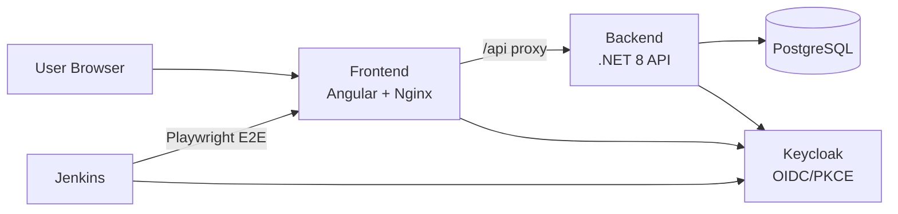

# HelpDesk Pro

A full-stack support ticket system built to demonstrate CI/CD with OpenShift.

## Architecture



| Component | Tech | Port |
|-----------|------|------|
| Frontend | Angular 17 + Material | 4200 (dev) / 8080 (container) |
| Backend | .NET 8 Web API | 8080 |
| Database | PostgreSQL 16 | 5432 |
| Auth | Keycloak 25 | 8180 (dev) / 8080 (container) |
| CI / E2E | Jenkins LTS + Playwright | 9090 (dev) / 8080 (container) |

## Prerequisites

- **Docker & Docker Compose** — required (all services run in containers)
- Node.js 20+ and npm (only for running E2E tests outside Docker)
- Helm 3.14+ (for OpenShift deploy)
- `oc` CLI (for OpenShift deploy)

> **Note:** .NET SDK and Angular CLI are **not** needed locally — the backend and frontend build inside Docker. You only need Node.js if you want to run Playwright E2E tests directly on your machine.

## Local Development

```bash
# Start all services
make up

# View logs
make logs

# Stop and clean up
make down
```

Services will be available at:
- **Frontend**: http://localhost:4200
- **Backend API**: http://localhost:8080/swagger
- **Keycloak Admin**: http://localhost:8180 (admin/admin)
- **Jenkins**: http://localhost:9090 (login via Keycloak SSO)

> **First boot:** Jenkins takes ~2 minutes to start while it loads plugins and applies configuration. Wait for the health check to pass (`docker compose logs -f jenkins`) before accessing the UI.

## Demo Users

| Username | Password | Roles | Access |
|----------|----------|-------|--------|
| employee1 | password123 | employee | Submit and view own tickets |
| admin1 | password123 | employee, helpdesk-admin | Manage all tickets + Jenkins admin |
| tester1 | password123 | helpdesk-tester | Trigger Jenkins test jobs |

## E2E Testing (Playwright)

The `e2e/` directory contains a Playwright test suite covering authentication, ticket submission, admin dashboard, and navigation — across two browsers (Chromium, Firefox) and two roles (employee, admin).

### Prerequisites

All services must be running first:

```bash
make up
```

### Run Tests

```bash
# Headless (CI-style)
make test-e2e

# Headed (see the browser)
make test-e2e-headed

# View the HTML report from the last run
make test-e2e-report
```

Or run manually without Make:

```bash
cd e2e
npm ci
npx playwright install --with-deps chromium firefox
BASE_URL=http://localhost:4200 npx playwright test
```

### Test Projects

Playwright is configured with four projects that combine role and browser:

| Project | Role | Browser |
|---------|------|---------|
| employee-chromium | employee1 | Chromium |
| employee-firefox | employee1 | Firefox |
| admin-chromium | admin1 | Chromium |
| admin-firefox | admin1 | Firefox |

Run a specific project:

```bash
cd e2e && npx playwright test --project=admin-chromium
```

## Jenkins (CI Server)

Jenkins is included as a fully configured CI server with Keycloak SSO authentication. It comes with a pre-configured **Run-Playwright-Tests** job.

### Local Access

After `make up`, Jenkins is available at **http://localhost:9090**. Log in via Keycloak:

- **admin1** — Full Jenkins admin (configure, manage, run jobs)
- **tester1** — Can view and trigger test jobs only

### Run-Playwright-Tests Job

This parameterized job runs the Playwright E2E suite against the running application:

| Parameter | Default | Description |
|-----------|---------|-------------|
| `BASE_URL` | `http://frontend:8080` | Application URL the tests run against |
| `BROWSER_PROJECT` | `all` | Which project(s) to run: `all`, `employee-chromium`, `employee-firefox`, `admin-chromium`, `admin-firefox` |
| `TEST_RETRIES` | `1` | Number of retries for flaky tests |

After a build completes, click **Playwright HTML Report** in the build sidebar to view the interactive test report.

### Jenkins Architecture

- **Authentication:** OIDC via Keycloak (realm `helpdesk`, client `helpdesk-jenkins`)
- **Configuration:** Jenkins Configuration as Code (JCasC) — all config is in `jenkins/casc/jenkins.yaml`
- **Browsers:** Chromium and Firefox are pre-installed in the Docker image to avoid downloading ~400 MB on each build
- **Plugins:** Defined in `jenkins/plugins.txt` (OIC Auth, Role Strategy, HTML Publisher, Job DSL, etc.)

## OpenShift Deployment

### 1. Configure GitHub Secrets

| Secret | Description |
|--------|-------------|
| `OPENSHIFT_TOKEN` | `oc whoami -t` |
| `OPENSHIFT_SERVER` | `oc whoami --show-server` |
| `OPENSHIFT_NAMESPACE` | Your OpenShift namespace (e.g. `myuser-dev`) |
| `KEYCLOAK_HOST` | Route hostname for Keycloak (bare hostname, no `https://`) |
| `FRONTEND_HOST` | Route hostname for the frontend (bare hostname, no `https://`) |
| `JENKINS_HOST` | Route hostname for Jenkins (bare hostname, no `https://`) |
| `GHCR_DOCKERCONFIGJSON` | Base64-encoded Docker config for GHCR pull secret |

To generate `GHCR_DOCKERCONFIGJSON`, create a GitHub Personal Access Token with `read:packages` scope
(**Settings → Developer settings → Personal access tokens → Tokens (classic)**), then run:

```bash
echo '{"auths":{"ghcr.io":{"auth":"'$(echo -n "<github-username>:<YOUR_PAT>" | base64)'"}}}'
```

Copy the full JSON output as the secret value.

### 2. Deploy

Push to `main` to trigger the GitHub Actions workflow, or deploy manually:

```bash
make deploy NAMESPACE=your-namespace
```

### 3. Check Status

```bash
make status NAMESPACE=your-namespace
make routes NAMESPACE=your-namespace
```

## Redeployment

After code changes, simply push to `main`. The CI/CD pipeline will:

1. Build three container images — backend, frontend, and Jenkins (tagged with commit SHA + `latest`)
2. Push all images to GitHub Container Registry (GHCR)
3. Deploy to OpenShift via Helm upgrade

## Redeployment After Sandbox Reset

The Red Hat Developer Sandbox resets every 30 days. Follow these steps to restore the environment from scratch in under 10 minutes.

### Step 1 — Log in to the new sandbox

Go to https://developers.redhat.com/developer-sandbox, start your new sandbox, then click **DevSandbox** to open the web console. Click your username (top-right) → **Copy login command** → **Display Token**.

```bash
oc login --token=<your-new-token> --server=<your-new-server>
```

### Step 2 — Update GitHub Secrets

```bash
# Get the values from your new session
oc whoami -t            # → OPENSHIFT_TOKEN
oc whoami --show-server # → OPENSHIFT_SERVER
```

Update both secrets in your GitHub repo: **Settings → Secrets and variables → Actions**.

### Step 3 — Do an initial deploy to create the routes

Trigger the pipeline (push an empty commit, or use workflow_dispatch):

```bash
git commit --allow-empty -m "chore: trigger redeploy after sandbox reset"
git push
```

Or deploy manually:

```bash
NAMESPACE=$(oc project -q)
make deploy NAMESPACE=$NAMESPACE
```

### Step 4 — Get all route hostnames

After the first deploy, OpenShift auto-assigns hostnames to all routes:

```bash
oc get routes -n $(oc project -q) -o custom-columns=NAME:.metadata.name,HOST:.spec.host
```

You need hostnames for three routes:
- `helpdesk-pro-keycloak` → `KEYCLOAK_HOST`
- `helpdesk-pro-frontend` → `FRONTEND_HOST`
- `helpdesk-pro-jenkins` → `JENKINS_HOST`

### Step 5 — Update all three host secrets

Copy each hostname (**without** `https://`) and update in GitHub: **Settings → Secrets and variables → Actions**.

| Secret | Example value |
|--------|---------------|
| `KEYCLOAK_HOST` | `helpdesk-pro-keycloak-myuser-dev.apps.rm1.0a51.p1.openshiftapps.com` |
| `FRONTEND_HOST` | `helpdesk-pro-frontend-myuser-dev.apps.rm1.0a51.p1.openshiftapps.com` |
| `JENKINS_HOST` | `helpdesk-pro-jenkins-myuser-dev.apps.rm1.0a51.p1.openshiftapps.com` |

> **Important:** Use bare hostnames only — no `https://` prefix. The Helm templates prepend the protocol where needed.

### Step 6 — Redeploy with the correct hostnames

Trigger the pipeline again (or re-run the last workflow from the Actions tab). This second deploy passes the correct hostnames so Keycloak, frontend, and Jenkins are wired up properly.

```bash
# Verify everything is running
make status NAMESPACE=$(oc project -q)
make routes NAMESPACE=$(oc project -q)
```

The app should be fully operational within a few minutes of the second deploy completing.

> **If Jenkins can't authenticate:** When deploying to a fresh cluster, Keycloak imports the realm only once (on first boot). If the realm was imported before the Jenkins client was added to the ConfigMap, Keycloak won't know about the Jenkins OIDC client. See [docs/Deployment_troubleshooting.md](docs/Deployment_troubleshooting.md) (issue #8) for the database reset procedure.


## Troubleshooting

For OpenShift-specific deployment issues (Keycloak realm imports, Jenkins OIDC, PVC errors, CSRF behind reverse proxy, etc.), see [docs/Deployment_troubleshooting.md](docs/Deployment_troubleshooting.md).

## Project Structure

```
.
├── backend/                  # .NET 8 Web API
│   ├── src/HelpDeskApi/      # Controllers, Services, Repositories, EF Core
│   └── Dockerfile
├── frontend/                 # Angular 17 SPA
│   ├── src/                  # App source (standalone components, no NgModules)
│   ├── nginx.conf            # Production proxy config (/api → backend)
│   └── Dockerfile
├── e2e/                      # Playwright E2E test suite
│   ├── tests/                # Test specs (admin/, auth/, employee/, navigation/)
│   ├── pages/                # Page Object Models
│   ├── fixtures/             # Test data and helpers
│   ├── scripts/              # CI entrypoint, install, and run scripts
│   └── playwright.config.ts
├── jenkins/                  # Jenkins CI server
│   ├── Dockerfile            # Jenkins + Node.js + Playwright browsers
│   ├── plugins.txt           # Jenkins plugin list
│   ├── casc/                 # Configuration as Code (JCasC)
│   └── jobs/                 # Job DSL definitions
├── helm/                     # Helm chart for OpenShift
│   ├── templates/            # K8s manifests (deployments, services, routes, etc.)
│   ├── values.yaml           # Default values
│   └── values.openshift.yaml # OpenShift security context overrides
├── keycloak/                 # Keycloak realm config (local dev)
│   └── realm-export.json
├── docs/                     # Documentation
│   └── Deployment_troubleshooting.md
├── docker-compose.yml        # Local development (all 5 services)
├── Makefile                  # Convenience targets
└── .github/workflows/        # CI/CD pipeline
    └── deploy.yml            # Build → Push → Helm deploy to OpenShift
```
